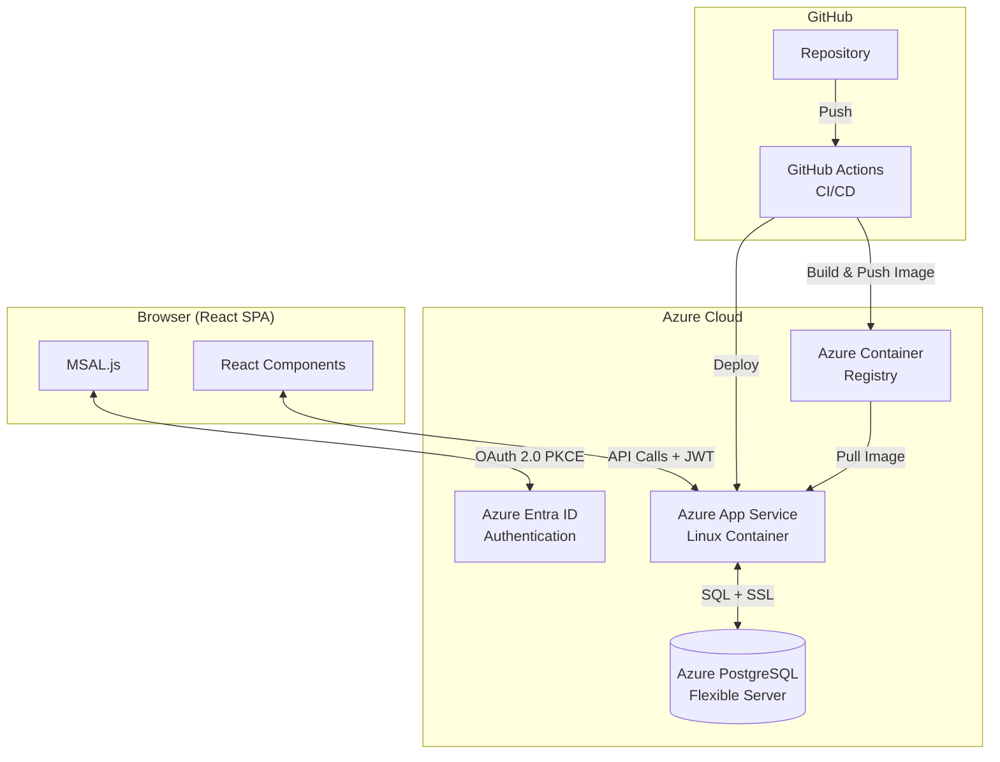
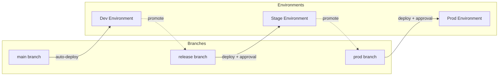
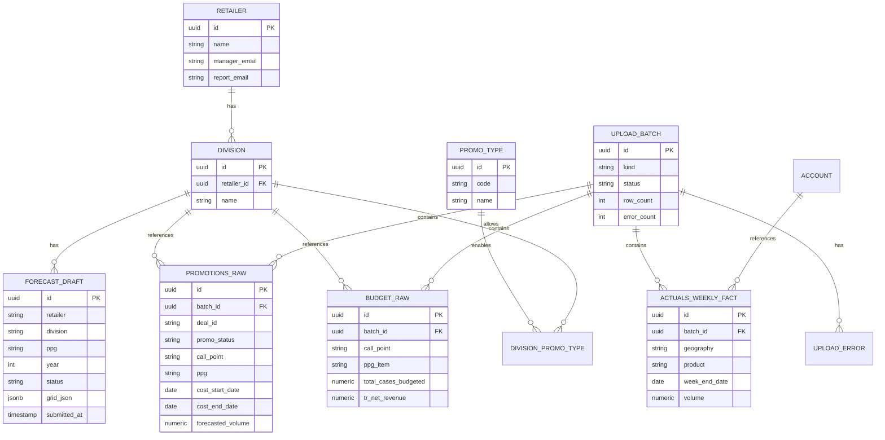
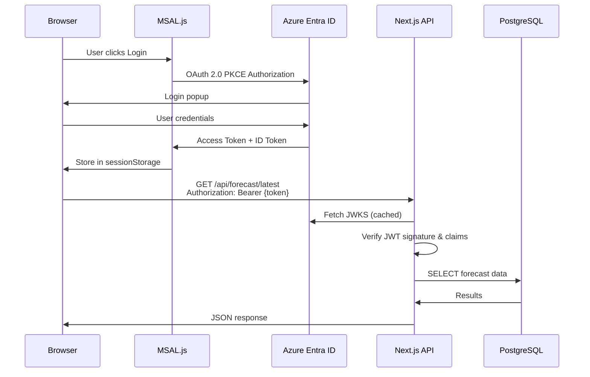
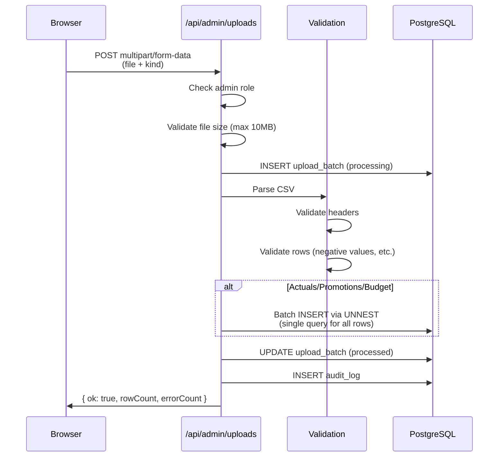
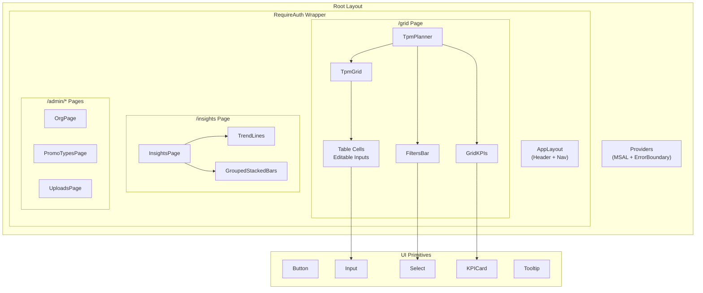
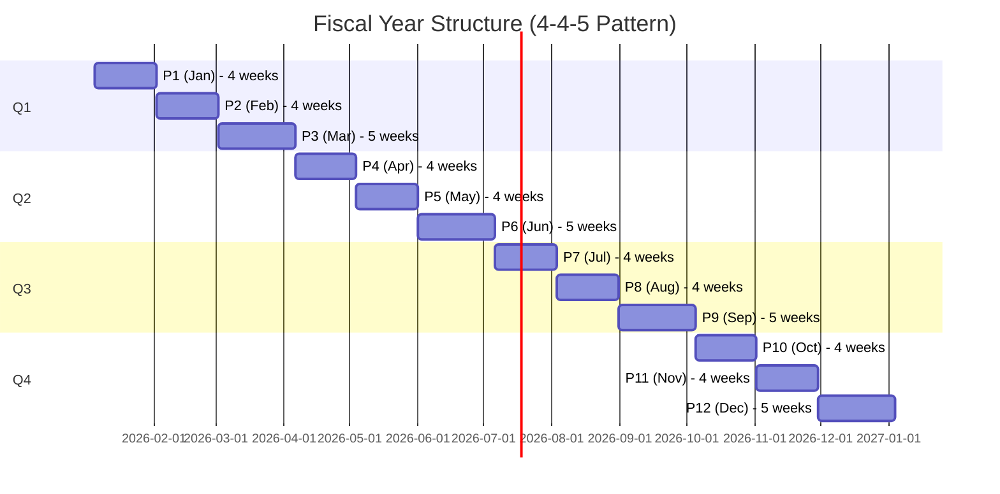
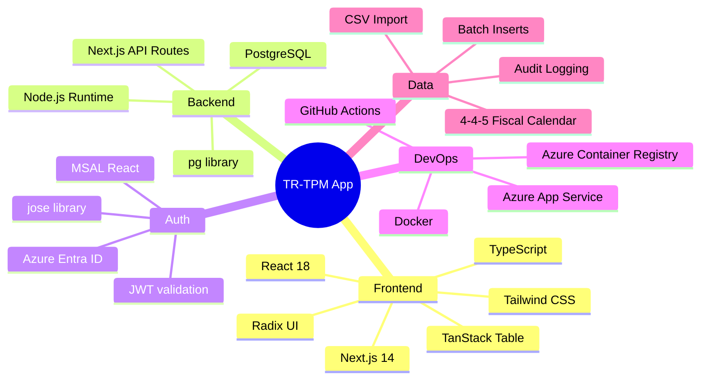

# TR-TPM App Architecture

## High-Level Architecture

## Deployment Pipeline

## Detailed Application Architecture

```mermaid
flowchart TB
    subgraph Browser["Client (Browser)"]
        subgraph Pages["Next.js Pages (App Router)"]
            Login["/login<br/>Public"]
            Grid["/grid<br/>Protected"]
            Insights["/insights<br/>Protected"]
            Admin["/admin/*<br/>Protected + Admin"]
            Help["/help<br/>Protected"]
        end

        subgraph Components["React Components"]
            AuthUI[AuthUI<br/>Login/Logout]
            TpmPlanner[TpmPlanner<br/>Main Grid Controller]
            TpmGrid[TpmGrid<br/>TanStack Table]
            FiltersBar[FiltersBar<br/>Retailer/Division/PPG]
            GridKPIs[GridKPIs<br/>Summary Cards]
            Charts[Insights Charts<br/>Trends & Bars]
        end

        subgraph ClientLib["Client Libraries"]
            MSALReact["@azure/msal-react"]
            TanStack["@tanstack/react-table"]
        end
    end

    subgraph Server["Next.js Server (Node.js)"]
        subgraph API["API Routes (/api)"]
            PublicConfig["/api/public-config"]
            TestDB["/api/test-db"]

            subgraph AuthRequired["Requires Auth"]
                ForecastAPI["/api/forecast/*<br/>draft, submit, latest"]
                DimensionsAPI["/api/dimensions/*<br/>actuals"]
                InsightsAPI["/api/insights/*"]
            end

            subgraph AdminRequired["Requires Admin"]
                OrgAPI["/api/admin/org"]
                PromoAPI["/api/admin/promo-types"]
                UploadsAPI["/api/admin/uploads"]
                WhoamiAPI["/api/admin/whoami"]
            end
        end

        subgraph Lib["Server Libraries"]
            DB["lib/db.ts<br/>PostgreSQL Pool"]
            AuthServer["lib/auth/server.ts<br/>JWT Validation"]
            AuthAdmin["lib/auth/admin.ts<br/>Admin Check"]
            Fiscal["lib/tpm/fiscal.ts<br/>4-4-5 Calendar"]
            CSV["lib/csv/*<br/>CSV Parsing"]
            Audit["lib/db/audit.ts<br/>Audit Logging"]
        end
    end

    subgraph External["External Services"]
        Entra[Azure Entra ID]
        Postgres[(PostgreSQL)]
    end

    %% Client interactions
    Login --> AuthUI
    Grid --> TpmPlanner
    TpmPlanner --> TpmGrid
    TpmPlanner --> FiltersBar
    TpmPlanner --> GridKPIs
    Insights --> Charts

    AuthUI --> MSALReact
    TpmGrid --> TanStack
    MSALReact <-->|OAuth 2.0| Entra

    %% API calls
    TpmPlanner -->|fetch + JWT| ForecastAPI
    TpmPlanner -->|fetch + JWT| DimensionsAPI
    Charts -->|fetch + JWT| InsightsAPI
    Admin -->|fetch + JWT| OrgAPI
    Admin -->|fetch + JWT| UploadsAPI

    %% Server internals
    ForecastAPI --> AuthServer
    DimensionsAPI --> AuthServer
    OrgAPI --> AuthAdmin
    UploadsAPI --> AuthAdmin
    UploadsAPI --> CSV

    AuthServer -->|Verify JWT| Entra
    AuthAdmin --> AuthServer

    ForecastAPI --> DB
    DimensionsAPI --> DB
    OrgAPI --> DB
    UploadsAPI --> DB
    UploadsAPI --> Audit

    ForecastAPI --> Fiscal

    DB <-->|SSL| Postgres
```

## Data Model (Core Entities)

## Request Flow (Authentication)

## Request Flow (CSV Upload)

## Component Hierarchy

## Fiscal Calendar (4-4-5 Pattern)

## Tech Stack Summary

